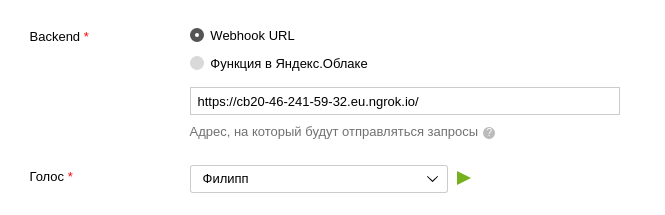

# Есть, что съесть

## .env

Перед запуском создайте файл `.env` примерно с таким содержанием:

```shell
API_ADDRESS=http://localhost:8080
LOG_FILE=alice.log
LOG_MODE=w
PORT=5000
SITE=eda.ru
```

## Запуск для тестирования:

1. `python app.py`
2. `ngrok http 5000`
3. Вставте ссылку 
4. Перейдите во вкладку "Тестрование"